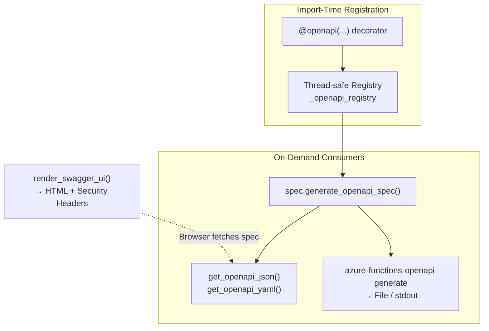

# DESIGN.md

Design Principles for `azure-functions-openapi`

## Purpose

This document defines the architectural boundaries and design principles of the project.

## Design Goals

- Generate OpenAPI documents for Azure Functions Python v2 handlers.
- Keep the decorator model explicit and predictable.
- Preserve Azure Functions runtime behavior instead of abstracting it away.
- Provide Swagger UI and CLI tooling without turning the package into a framework.

## Non-Goals

This project does not aim to:

- Replace Azure Functions routing or hosting behavior
- Hide the `func.FunctionApp()` programming model
- Become a general web framework
- Own deployment, infrastructure, or application lifecycle concerns

## Design Principles

- Explicit metadata is preferred over magic inference.
- Decorators should collect metadata, not change core handler semantics.
- OpenAPI generation and UI rendering should remain separate concerns.
- Public APIs should evolve conservatively.
- Example applications should demonstrate supported patterns, not internal shortcuts.

## Architecture

### Core Mechanism: Import-Time Registration + On-Demand Compilation

The architecture separates metadata capture (import-time) from document generation (request-time or CLI-time). The `@openapi` decorator collects metadata into a thread-safe registry; the spec compiler and CLI read the registry to produce OpenAPI documents. Swagger UI rendering is a separate concern that does not access the registry.

Note: `render_swagger_ui()` does not embed or generate the OpenAPI spec. It returns HTML that instructs the browser to fetch the spec from a configured URL.

## Integration Boundaries

- Runtime validation belongs to `azure-functions-validation`.
- Diagnostics belong to `azure-functions-doctor`.
- This repository owns OpenAPI metadata capture, document generation, and documentation UI helpers.

## Compatibility Policy

- Minimum supported Python version: `3.10`
- Supported runtime target: Azure Functions Python v2 programming model
- Public APIs follow semantic versioning expectations

## Change Discipline

- Changes to decorator behavior require strong regression coverage.
- Changes to generated spec defaults must be treated as user-facing behavior changes.
- Experimental APIs must be clearly labeled in code and docs.

## Sources

- [Azure Functions Python developer reference](https://learn.microsoft.com/en-us/azure/azure-functions/functions-reference-python)
- [Azure Functions HTTP trigger](https://learn.microsoft.com/en-us/azure/azure-functions/functions-bindings-http-webhook-trigger)
- [Supported languages in Azure Functions](https://learn.microsoft.com/en-us/azure/azure-functions/supported-languages)

## See Also

- [azure-functions-validation — Architecture](https://github.com/yeongseon/azure-functions-validation) — Request/response validation pipeline
- [azure-functions-logging — Architecture](https://github.com/yeongseon/azure-functions-logging) — Structured logging with contextvars
- [azure-functions-doctor — Architecture](https://github.com/yeongseon/azure-functions-doctor) — Pre-deploy diagnostic CLI
- [azure-functions-scaffold — Architecture](https://github.com/yeongseon/azure-functions-scaffold) — Project scaffolding CLI
- [azure-functions-langgraph — Architecture](https://github.com/yeongseon/azure-functions-langgraph) — LangGraph agent deployment
