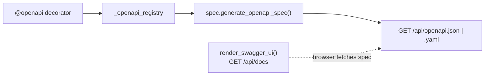
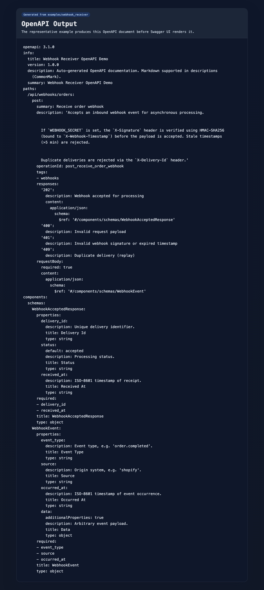
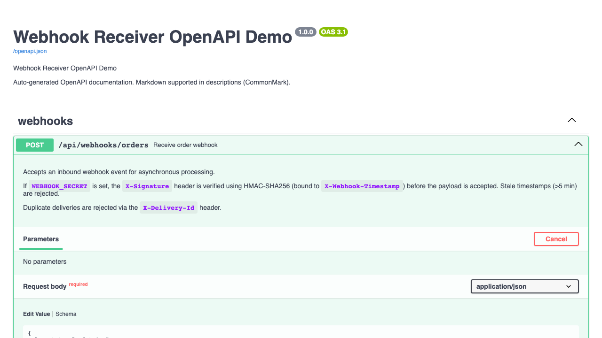

# Azure Functions OpenAPI

> Part of the **Azure Functions Python DX Toolkit** — dogfood-tested by [azure-functions-cookbook-python](https://github.com/yeongseon/azure-functions-cookbook-python).

[](https://pypi.org/project/azure-functions-openapi/)
[](https://pepy.tech/project/azure-functions-openapi)
[](https://pypi.org/project/azure-functions-openapi/)
[](https://github.com/yeongseon/azure-functions-openapi-python/actions/workflows/ci-test.yml)
[](https://github.com/yeongseon/azure-functions-openapi-python/actions/workflows/publish-pypi.yml)
[](https://github.com/yeongseon/azure-functions-openapi-python/actions/workflows/security.yml)
[](https://codecov.io/gh/yeongseon/azure-functions-openapi-python)
[](https://pre-commit.com/)
[](https://yeongseon.dev/azure-functions-python/openapi/)
[](LICENSE)

Read this in: [한국어](README.ko.md) | [日本語](README.ja.md) | [简体中文](README.zh-CN.md)

OpenAPI (Swagger) documentation and Swagger UI for the **Azure Functions Python v2 programming model**.

## Why this exists

Azure Functions Python v2 has no built-in API documentation story:

- **No auto-generated docs** — you maintain OpenAPI specs by hand or not at all
- **No Swagger UI** — no browser-based API explorer for testing endpoints
- **Hard to test** — consumers rely on tribal knowledge or external tools to discover your API
- **Spec drift** — hand-written docs diverge from actual handler behavior over time

## Before / After

**❌ Without azure-functions-openapi** — maintain specs by hand

```python
# openapi_spec.json — manually written, manually updated
{
    "paths": {
        "/api/users": {
            "post": {
                "summary": "Create user",
                "requestBody": { "...": "..." },
                "responses": { "200": { "...": "..." } }
            }
        }
    }
}

# function_app.py — no connection to the spec above
@app.route(route="users", methods=["POST"])
def create_user(req):
    ...
```

Spec drifts. Consumers guess. No Swagger UI.

**✅ With azure-functions-openapi** — spec lives next to the handler

```python
from pydantic import BaseModel


class CreateUserRequest(BaseModel):
    name: str


class UserResponse(BaseModel):
    id: str
    name: str


@openapi(
    summary="Create user",
    requests=CreateUserRequest,
    responses=UserResponse,
)
@app.route(route="users", methods=["POST"])
def create_user(req):
    ...

# Auto-generated endpoints:
# GET /api/openapi.json  — always in sync
# GET /api/docs          — Swagger UI included
```

Spec matches code. Always. Swagger UI out of the box.

## What it does

- **`@openapi` decorator** — attach operation metadata directly to your handler
- **Auto-generated spec** — `/openapi.json` and `/openapi.yaml` endpoints from decorated handlers
- **Swagger UI** — built-in `/docs` endpoint with security defaults
- **CLI tooling** — generate specs at build time for CI validation
- **Schema support** — query, path, header, body, and response schemas
- **`auth_level` security inference** — opt-in `infer_auth_level=True` derives OpenAPI security from a route's Azure Functions `auth_level` (see [Usage Guide](docs/usage.md#infer-security-from-auth_level-opt-in))


### How it fits together



## FastAPI comparison

| Feature | FastAPI | azure-functions-openapi |
|---------|---------|------------------------|
| API docs generation | Built-in from type hints | `@openapi` decorator on handlers |
| Swagger UI | `/docs` auto-served | `render_swagger_ui()` endpoint |
| OpenAPI spec | Auto-generated `/openapi.json` | `get_openapi_json()` endpoint |
| CLI spec export | N/A | `azure-functions-openapi generate` |
| Pydantic integration | Native | `requests=` / `responses=` |

## Scope

- Azure Functions Python **v2 programming model**
- Decorator-based `func.FunctionApp()` applications
- HTTP-triggered functions documented with `@openapi`
- Pydantic schema generation (requires Pydantic v2)

This package does **not** support the legacy `function.json`-based v1 programming model.

## What this package does not do

This package does not own:
- Runtime exposure or graph deployment — use [`azure-functions-langgraph`](https://github.com/yeongseon/azure-functions-langgraph-python)
- Request/response validation or serialization — use [`azure-functions-validation`](https://github.com/yeongseon/azure-functions-validation-python)
- Project scaffolding — use [`azure-functions-scaffold`](https://github.com/yeongseon/azure-functions-scaffold-python)

## CLI Quick Start

Generate an OpenAPI spec from your decorated function app:

```bash
# Install
pip install azure-functions-openapi

# Generate spec from a function app module (registers @openapi routes)
azure-functions-openapi generate --app function_app --title "My API" --format json

# Write to file with pretty-printing
azure-functions-openapi generate --app function_app --title "My API" --pretty --output openapi.json

# YAML output
azure-functions-openapi generate --app function_app --format yaml --output openapi.yaml
```

Pass `module:variable` to resolve the `FunctionApp` instance and also discover
endpoint-metadata routes — those registered by producers like `@validate_http`
or `azure-functions-langgraph` — merging them with your `@openapi` routes into a
single spec. With `module` alone the CLI imports the module (firing `@openapi`
decorators) but does not scan for endpoint metadata:

```bash
azure-functions-openapi generate --app function_app:app --title "My API"
```

See the [CLI Guide](docs/cli.md) for all options and CI integration examples.

## Installation

```bash
pip install azure-functions-openapi
```

Your Function App dependencies should include:

```text
azure-functions
azure-functions-openapi
```

## SDK Compatibility

This package discovers routes, methods, and handlers from the `azure-functions` SDK through a single isolated adapter (`azure_functions_openapi.adapters`). Discovery is **public-API-first**: it enumerates via the public, idempotent `FunctionBuilder.build()` and reads everything else through public `Function` accessors (`get_function_name` / `get_user_function` / `get_bindings` / `is_http_function`). The adapter never calls the non-idempotent `FunctionApp.get_functions()`. The **one** unavoidable private token — `app._function_builders`, which has no public substitute for enumeration — lives exclusively in the adapter and is covered by a mandatory guard test. We validate the package against an explicit matrix in CI. See [issue #258](https://github.com/yeongseon/azure-functions-openapi-python/issues/258) and [issue #327](https://github.com/yeongseon/azure-functions-openapi-python/issues/327) for background.

| `azure-functions` | Python 3.10 | Python 3.11 | Python 3.12 | Python 3.13 | Python 3.14 |
| ----------------- | :---------: | :---------: | :---------: | :---------: | :---------: |
| `1.21.0` (floor)  | ✅ tested   |             |             |             |             |
| `1.24.0`          | ✅ tested   |             |             |             |             |
| `latest` (`<2.0`) | ✅ tested   | ✅ tested   | ✅ tested   | ✅ tested   | ✅ tested   |

The version pin in `pyproject.toml` is `azure-functions>=1.21.0,<2.0.0`. The floor is `1.21.0` because earlier releases return `None` from `FunctionBuilder.__call__` (breaking direct invocation of decorated handlers in tests and CLI extraction). If you need a newer SDK, please open an issue — the ceiling is intentional because `azure-functions` 2.x drops support for Python < 3.13 and has not yet been validated against `@openapi`.

## Quick Start

```python
import json

import azure.functions as func
from pydantic import BaseModel

from azure_functions_openapi import (
    get_openapi_json,
    get_openapi_yaml,
    openapi,
    render_swagger_ui,
)

app = func.FunctionApp()


# Describe your API with plain Pydantic models.
class GreetRequest(BaseModel):
    name: str


class GreetResponse(BaseModel):
    message: str


# @openapi infers the route and method from the @app.route below —
# no need to repeat them here.
@openapi(
    summary="Greet user",
    tags=["Example"],
    requests=GreetRequest,
    responses=GreetResponse,
)
@app.route(route="http_trigger", auth_level=func.AuthLevel.ANONYMOUS, methods=["POST"])
def http_trigger(req: func.HttpRequest) -> func.HttpResponse:
    # @openapi documents the request/response contract — it does not validate.
    # For runtime validation, see azure-functions-validation.
    data = req.get_json()
    name = data.get("name", "world")
    return func.HttpResponse(
        json.dumps({"message": f"Hello, {name}!"}),
        mimetype="application/json",
    )
```

> **Pydantic v2 is optional.** `requests=` / `responses=` are the recommended path, but you can pass raw JSON Schema dicts instead (see below) if you'd rather not add a dependency.

> **Want runtime validation too? (optional)** `@openapi` documents your Pydantic models — it does not parse or validate requests at runtime. If you also want automatic request parsing, consistent `400`/`422` error responses, and response-model enforcement, layer [`azure-functions-validation`](https://github.com/yeongseon/azure-functions-validation-python)'s `@validate_http` on the **same** Pydantic models. It is an optional companion, not a dependency — this package works fully on its own. See the [validation README](https://github.com/yeongseon/azure-functions-validation-python#readme) for details, or a full runnable example that pairs both on one resource: [Full Stack CRUD API](https://github.com/yeongseon/azure-functions-cookbook-python/tree/main/examples/apis-and-ingress/full_stack_crud_api).

> **Want structured logging too? (optional)** Pair your documented endpoints with [`azure-functions-logging`](https://github.com/yeongseon/azure-functions-logging-python) for structured, correlation-aware logs and observability. It attaches request/response context to every log line without changing your `@openapi` contracts. Like validation, it is an optional companion, not a dependency — this package works fully on its own. See the [logging README](https://github.com/yeongseon/azure-functions-logging-python#readme) for details.

<details>
<summary>Wire up the spec + Swagger UI endpoints (openapi.json / openapi.yaml / docs)</summary>

```python
# Serve the generated spec and Swagger UI as ordinary HTTP routes.
@app.route(route="openapi.json", auth_level=func.AuthLevel.ANONYMOUS, methods=["GET"])
def openapi_json(req: func.HttpRequest) -> func.HttpResponse:
    return func.HttpResponse(
        get_openapi_json(
            title="Sample API",
            description="OpenAPI document for the Sample API.",
        ),
        mimetype="application/json",
    )


@app.route(route="openapi.yaml", auth_level=func.AuthLevel.ANONYMOUS, methods=["GET"])
def openapi_yaml(req: func.HttpRequest) -> func.HttpResponse:
    return func.HttpResponse(
        get_openapi_yaml(
            title="Sample API",
            description="OpenAPI document for the Sample API.",
        ),
        mimetype="application/x-yaml",
    )


@app.route(route="docs", auth_level=func.AuthLevel.ANONYMOUS, methods=["GET"])
def swagger_ui(req: func.HttpRequest) -> func.HttpResponse:
    return render_swagger_ui()
```

</details>

<details>
<summary>Advanced: describe the schema with raw JSON Schema instead of Pydantic</summary>

```python
@openapi(
    summary="Greet user",
    tags=["Example"],
    requests={
        "type": "object",
        "properties": {"name": {"type": "string"}},
        "required": ["name"],
    },
    responses={
        200: {
            "description": "Successful greeting",
            "content": {
                "application/json": {
                    "schema": {
                        "type": "object",
                        "properties": {"message": {"type": "string"}},
                    }
                }
            },
        }
    },
)
@app.route(route="http_trigger", auth_level=func.AuthLevel.ANONYMOUS, methods=["POST"])
def http_trigger(req: func.HttpRequest) -> func.HttpResponse:
    ...
```

</details>

Run locally with Azure Functions Core Tools:

```bash
func start
```


### Verify locally and on Azure

After deploying (see [docs/deployment.md](docs/deployment.md)), the same request produces the same response in both environments.

#### Local

```bash
curl -s http://localhost:7071/api/http_trigger \
  -H "Content-Type: application/json" \
  -d '{"name": "World"}'
```

```json
{"message": "Hello, World!"}
```

#### Azure

```bash
curl -s "https://<your-app>.azurewebsites.net/api/http_trigger" \
  -H "Content-Type: application/json" \
  -d '{"name": "World"}'
```

```json
{"message": "Hello, World!"}
```

The `/api/openapi.json`, `/api/openapi.yaml`, and `/api/docs` endpoints are also available in both environments.

> Verified against a temporary Azure Functions deployment in koreacentral (Python 3.12, Consumption plan). Response captured and URL anonymized.

## Demo

The representative `webhook_receiver` example shows the full outcome of adopting this library:

- You annotate an Azure Functions v2 HTTP handler with `@openapi`.
- The package generates a real OpenAPI document for that route.
- The same route is rendered in Swagger UI for browser-based inspection.

### Generated Spec Result

The generated OpenAPI file is captured as a static preview from the same example run, so the README shows the actual document produced by the representative function.



### Swagger UI Result

The web preview below is generated from the same representative example and captured automatically from the rendered Swagger UI page produced by that example flow.



## When to use

- You have HTTP-triggered Azure Functions and need API documentation
- You want Swagger UI for browser-based API testing
- You need OpenAPI specs for client code generation or CI validation
- You want to keep docs in sync with handler code automatically

## Documentation

- Full docs: [yeongseon.dev/azure-functions-python/openapi](https://yeongseon.dev/azure-functions-python/openapi/)
- Smoke-tested examples: `examples/`
- [Installation Guide](docs/installation.md)
- [Usage Guide](docs/usage.md)
- [API Reference](docs/api.md)
- [CLI Guide](docs/cli.md)
- **Extend this:** [Producer Guide — write your own endpoint metadata](docs/extending/producer-guide.md)

## Ecosystem

This package is part of the **Azure Functions Python DX Toolkit**.

**Design principle:** `azure-functions-openapi` owns API documentation and spec generation. `azure-functions-validation` owns request/response validation and serialization. `azure-functions-langgraph` owns LangGraph runtime exposure.

| Package | Role |
|---------|------|
| **azure-functions-openapi-python** | OpenAPI spec generation and Swagger UI |
| [azure-functions-validation-python](https://github.com/yeongseon/azure-functions-validation-python) | Request/response validation and serialization |
| [azure-functions-db-python](https://github.com/yeongseon/azure-functions-db-python) | SQLAlchemy-powered DB integration helpers (poll-based pseudo trigger, input/output/client injection) |
| [azure-functions-langgraph-python](https://github.com/yeongseon/azure-functions-langgraph-python) | LangGraph deployment adapter for Azure Functions |
| [azure-functions-scaffold-python](https://github.com/yeongseon/azure-functions-scaffold-python) | Project scaffolding CLI |
| [azure-functions-logging-python](https://github.com/yeongseon/azure-functions-logging-python) | Structured logging and observability |
| [azure-functions-doctor-python](https://github.com/yeongseon/azure-functions-doctor-python) | Pre-deploy diagnostic CLI |
| [azure-functions-durable-graph-python](https://github.com/yeongseon/azure-functions-durable-graph-python) | Manifest-first graph runtime with Durable Functions *(experimental)* |
| [azure-functions-knowledge-python](https://github.com/yeongseon/azure-functions-knowledge-python) | Knowledge retrieval (RAG) decorators |
| [azure-functions-cookbook-python](https://github.com/yeongseon/azure-functions-cookbook-python) | Dogfood examples — runnable recipes that exercise the full toolkit |

## For AI Coding Assistants

This repository includes `llms.txt` and `llms-full.txt` in the root directory.
These files provide comprehensive package and API information optimized for LLM context windows.

- **`llms.txt`** — Quick reference with core API, installation, and quick-start example
- **`llms-full.txt`** — Complete reference with full signatures, patterns, design principles, and ecosystem context

Use these files to get better context when working with this package in AI-assisted coding environments.

## Disclaimer

This project is an independent community project and is not affiliated with,
endorsed by, or maintained by Microsoft.

Azure and Azure Functions are trademarks of Microsoft Corporation.

## License

MIT
