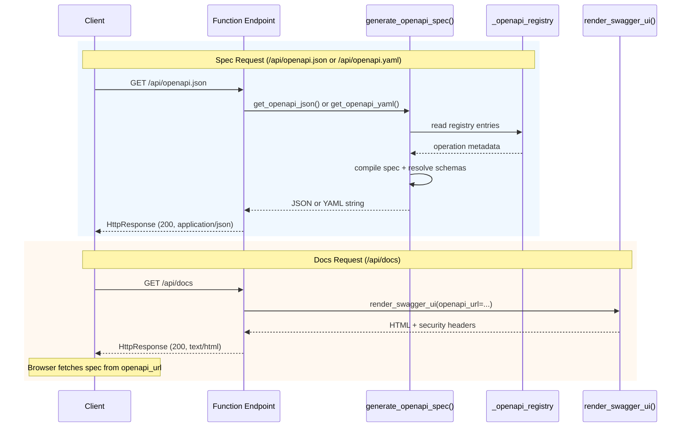
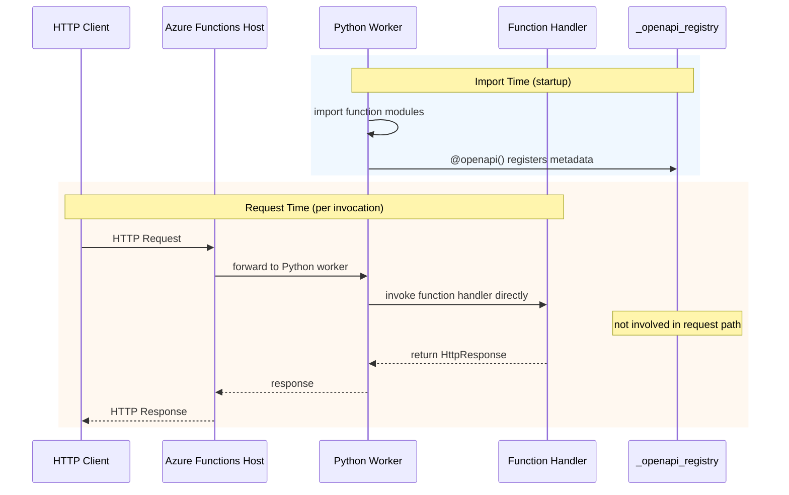
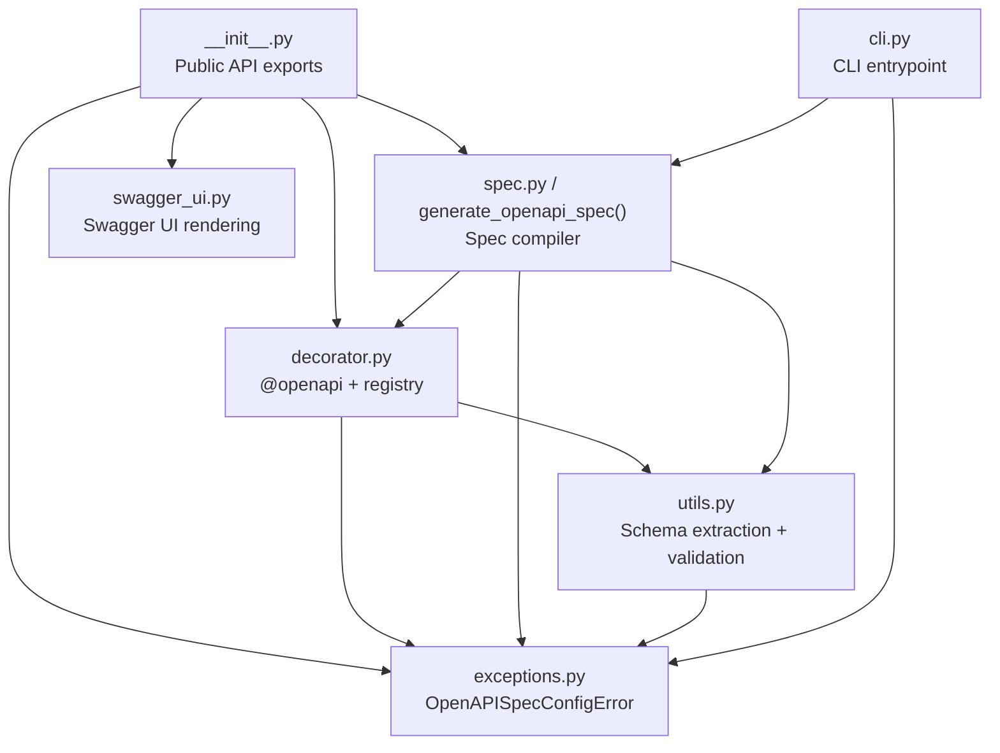

# Architecture

This document explains how `azure-functions-openapi` transforms decorator metadata into OpenAPI output and Swagger UI responses.

## Design Objectives

- Keep the decorator model explicit and predictable.
- Separate metadata capture (import-time) from document generation (request-time).
- Treat OpenAPI generation and CLI output as registry consumers, with Swagger UI rendering as a separate HTML helper.
- Keep the module count small and the dependency graph shallow.

## High-Level Flow

The architecture operates in two phases: import-time registration and on-demand consumption.

### Phase 1: Import-Time Registration

1. Python imports function modules.
2. `@openapi(...)` decorator executes and registers operation metadata.
3. Metadata is stored in the thread-safe `_openapi_registry`.

### Phase 2: On-Demand Consumption

Note: `render_swagger_ui()` does not generate or embed the OpenAPI spec. It returns HTML that instructs the browser to fetch the spec from a configured URL. The CLI (`azure-functions-openapi generate`) is another on-demand consumer that imports the app module to trigger registration, then compiles the spec to file or stdout.

## Request Flow and Runtime Relationship

`@openapi` is a **metadata-only decorator**. It executes once at import time to register operation metadata in the in-process registry. It does not intercept, modify, or participate in HTTP request processing at runtime.

The registry is consumed only when a client explicitly requests the spec (`GET /api/openapi.json`) or docs (`GET /api/docs`). Normal API requests bypass the registry entirely.

## Module Boundaries

### `decorator.py`

- Provides `@openapi(...)` decorator.
- Validates and sanitizes decorator inputs.
- Stores operation metadata in `_openapi_registry` (protected by `threading.RLock`).
- Exposes `get_openapi_registry()` snapshot accessor.
- Tags default to `['default']` when not provided; invalid route path or operation ID raises `ValueError`.

### `openapi.py`

- Compiles registry into OpenAPI document via `generate_openapi_spec()`.
- Serializes to JSON (`get_openapi_json`) and YAML (`get_openapi_yaml`).
- Supports OpenAPI 3.0.0 and 3.1.0 output (3.1 converts `nullable` to union types, `example` to `examples`).
- Resolves routes, methods, request/response schemas, Pydantic model components, and security schemes.

### `utils.py`

- Pydantic v2 schema extraction (`model_to_schema`).
- `$ref` rewriting to `#/components/schemas/...`.
- Schema collision resolution for repeated model names (suffixed `_2`, `_3`, ...).
- Route and operation ID validation helpers.

### `swagger_ui.py`

- Renders Swagger UI HTML via `render_swagger_ui()`.
- Applies security headers: `Content-Security-Policy`, `X-Content-Type-Options`, `X-Frame-Options`, `Referrer-Policy`, and cache prevention headers.
- Sanitizes title and URL inputs.

### `cli.py`

- Parses `azure-functions-openapi generate` command.
- Outputs JSON or YAML to stdout or file.
- Selects OpenAPI version (`3.0` or `3.1`).

### `exceptions.py`

- Defines `OpenAPISpecConfigError` (subclass of `ValueError`) for caller-fixable configuration errors.

## Public API Boundary

Exported symbols (via `__all__`):

- `openapi` — decorator for annotating function handlers
- `generate_openapi_spec` — compile registry into spec dictionary
- `get_openapi_json` — serialize spec to JSON string
- `get_openapi_yaml` — serialize spec to YAML string
- `render_swagger_ui` — generate Swagger UI HTML response
- `OpenAPISpecConfigError` — configuration error exception
- `OPENAPI_VERSION_3_0` — version constant (`"3.0.0"`)
- `OPENAPI_VERSION_3_1` — version constant (`"3.1.0"`)
- `__version__` — package version string

CLI contract: `azure-functions-openapi generate` (entrypoint: `azure_functions_openapi.cli:main`).

Everything else (registry internals, utility functions, module layout) is implementation detail.

## Key Design Decisions

### Runtime-Decorator Driven Metadata

No function source parsing. All metadata is captured through the `@openapi(...)` decorator at import time. This means the registry only contains what users explicitly declare.

### In-Process Registry (No Persistence)

The registry exists in process memory only. There is no file, database, or external cache. This keeps the architecture simple but requires that all function modules are imported before spec generation.

### Separate Spec Generation and UI Rendering

`openapi.py` and `cli.py` are registry consumers that compile the spec on demand. `swagger_ui.py` is independent — it does not access the registry. It returns HTML that instructs the browser to fetch the spec from a configured URL. This means the spec endpoint and docs endpoint can be deployed or disabled independently.

### Thread-Safe Registration

The `_openapi_registry` is protected by `threading.RLock`, ensuring safe concurrent decorator execution during module import.

### Extension Points

- Customize spec metadata via generator arguments (`title`, `version`, `description`).
- Configure security centrally (`security_schemes`) or per operation (`security_scheme`).
- Customize UI CSP and behavior via `render_swagger_ui(...)`.

### Programmatic Registration API (v0.16+)

`register_openapi_metadata()` in `decorator.py` allows external packages to register route metadata without using the `@openapi` decorator. This is the integration contract for ecosystem packages that define their own HTTP endpoints and want OpenAPI documentation generated by this package.

The function accepts a similar core metadata shape to `@openapi(...)` (path, method, operation_id, summary, request/response schemas, etc.) and writes directly to the shared `_openapi_registry`. Once registered, routes appear in the generated spec alongside decorator-registered routes.

**Reference consumer:** [`azure-functions-langgraph`](https://github.com/yeongseon/azure-functions-langgraph) uses its bridge module (`azure_functions_langgraph.openapi.register_with_openapi`) to read route metadata from its `get_app_metadata()` API and forward it to `register_openapi_metadata()`. This pattern demonstrates how any Azure Functions package can contribute routes to the OpenAPI spec without depending on the `@openapi` decorator.

The architecture intentionally keeps bridge implementation in the *consumer* package (langgraph), not here. This package defines the contract; consumers decide when and how to call it.

### Operational Considerations

- Missing imports can lead to empty `paths` in the generated spec.
- Inconsistent `@app.route` vs `@openapi(route=...)` leads to documentation/runtime mismatch.
- Model schema generation is resilient, but invalid model usage raises explicit errors.

## What this package owns

- OpenAPI spec generation from decorated handlers and programmatic metadata
- Swagger UI rendering with security defaults
- CLI spec generation for CI pipelines
- The `_openapi_registry` as the single source of truth for operation metadata
- `register_openapi_metadata()` as the integration contract for ecosystem packages

## What this package does not own

- Runtime exposure or graph deployment (owned by `azure-functions-langgraph`)
- Request/response validation or serialization (owned by `azure-functions-validation`)
- Pre-deploy diagnostics (owned by `azure-functions-doctor`)
- Structured logging (owned by `azure-functions-logging`)
- Project scaffolding (owned by `azure-functions-scaffold`)

## Related Documents

- [Usage](usage.md)
- [Configuration](configuration.md)
- [API Reference](api.md)
- [Troubleshooting](troubleshooting.md)

## Sources

- [Azure Functions Python developer reference](https://learn.microsoft.com/en-us/azure/azure-functions/functions-reference-python)
- [Azure Functions HTTP trigger](https://learn.microsoft.com/en-us/azure/azure-functions/functions-bindings-http-webhook-trigger)
- [Supported languages in Azure Functions](https://learn.microsoft.com/en-us/azure/azure-functions/supported-languages)

## See Also

- [azure-functions-langgraph — Architecture](https://github.com/yeongseon/azure-functions-langgraph) — LangGraph deployment adapter (reference consumer of `register_openapi_metadata()`)
- [azure-functions-validation — Architecture](https://github.com/yeongseon/azure-functions-validation) — Request/response validation pipeline
- [azure-functions-logging — Architecture](https://github.com/yeongseon/azure-functions-logging) — Structured logging with contextvars
- [azure-functions-doctor — Architecture](https://github.com/yeongseon/azure-functions-doctor) — Pre-deploy diagnostic CLI
- [azure-functions-scaffold — Architecture](https://github.com/yeongseon/azure-functions-scaffold) — Project scaffolding CLI
