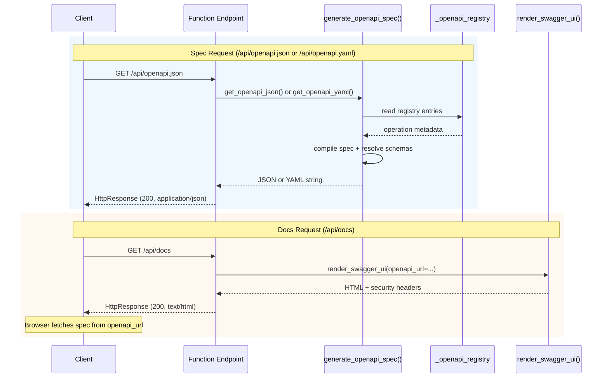
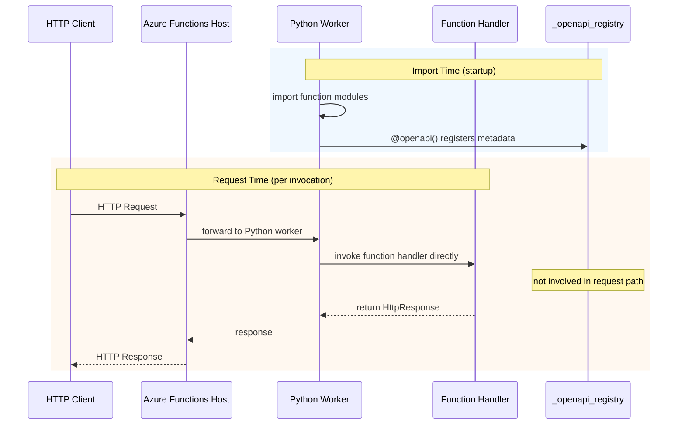
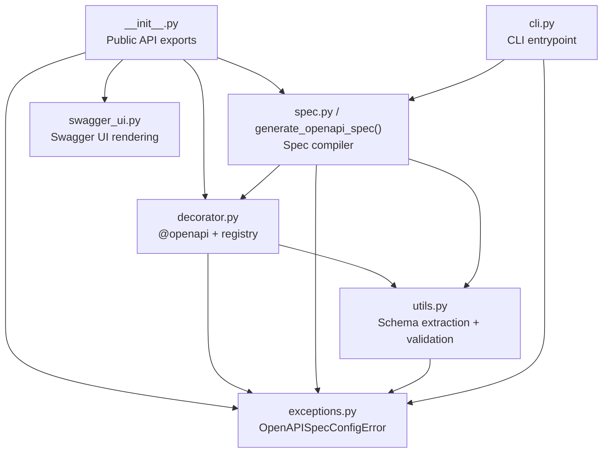

# Architecture

This document explains how `azure-functions-openapi` transforms decorator metadata into OpenAPI output and Swagger UI responses.

## Design Objectives

- Keep the decorator model explicit and predictable.
- Separate metadata capture (import-time) from document generation (request-time).
- Treat OpenAPI generation and CLI output as registry consumers, with Swagger UI rendering as a separate HTML helper.
- Keep the module count small and the dependency graph shallow.

## High-Level Flow

The architecture operates in two phases: import-time registration and on-demand consumption.

### Phase 1: Import-Time Registration

1. Python imports function modules.
2. `@openapi(...)` decorator executes and registers operation metadata.
3. Metadata is stored in the thread-safe `_openapi_registry`.

### Phase 2: On-Demand Consumption


```mermaid
sequenceDiagram
    participant Client
    participant Endpoint as Function Endpoint
    participant Gen as generate_openapi_spec()
    participant Reg as _openapi_registry
    participant UI as render_swagger_ui()

    rect rgb(240, 248, 255)
    note over Client,Reg: Spec Request (/api/openapi.json or /api/openapi.yaml)
    Client->>Endpoint: GET /api/openapi.json
    Endpoint->>Gen: get_openapi_json() or get_openapi_yaml()
    Gen->>Reg: read registry entries
    Reg-->>Gen: operation metadata
    Gen->>Gen: compile spec + resolve schemas
    Gen-->>Endpoint: JSON or YAML string
    Endpoint-->>Client: HttpResponse (200, application/json)
    end

    rect rgb(255, 248, 240)
    note over Client,UI: Docs Request (/api/docs)
    Client->>Endpoint: GET /api/docs
    Endpoint->>UI: render_swagger_ui(openapi_url=...)
    UI-->>Endpoint: HTML + security headers
    Endpoint-->>Client: HttpResponse (200, text/html)
    note over Client: Browser fetches spec from openapi_url
    end
```

Note: `render_swagger_ui()` does not generate or embed the OpenAPI spec. It returns HTML that instructs the browser to fetch the spec from a configured URL. The CLI (`azure-functions-openapi generate`) is another on-demand consumer that imports the app module to trigger registration, then compiles the spec to file or stdout.

## Request Flow and Runtime Relationship

`@openapi` is a **metadata-only decorator**. It executes once at import time to register operation metadata in the in-process registry. It does not intercept, modify, or participate in HTTP request processing at runtime.


```mermaid
sequenceDiagram
    participant Client as HTTP Client
    participant Host as Azure Functions Host
    participant Worker as Python Worker
    participant Handler as Function Handler
    participant Reg as _openapi_registry

    rect rgb(240, 248, 255)
    note over Worker,Reg: Import Time (startup)
    Worker->>Worker: import function modules
    Worker->>Reg: @openapi() registers metadata
    end

    rect rgb(255, 248, 240)
    note over Client,Handler: Request Time (per invocation)
    Client->>Host: HTTP Request
    Host->>Worker: forward to Python worker
    Worker->>Handler: invoke function handler directly
    note over Reg: not involved in request path
    Handler-->>Worker: return HttpResponse
    Worker-->>Host: response
    Host-->>Client: HTTP Response
    end
```

The registry is consumed only when a client explicitly requests the spec (`GET /api/openapi.json`) or docs (`GET /api/docs`). Normal API requests bypass the registry entirely.

## How Route Discovery Works

Discovery is how this package finds every HTTP route on a `FunctionApp` and reconciles it with `@openapi(...)` metadata. It runs at **import time** inside `function_app.py` (via `scan_endpoint_metadata`), when `generate_openapi_spec(app=app)` receives the app, or on demand from the CLI (`generate --app module:variable`). Route and method come **binding-first**: the Azure `@app.route(...)` binding is the source of truth, and `@openapi(...)` only enriches the operation the binding already defines. For the shared `FunctionBuilder` background this relies on, see [How the worker binds handlers §2](https://yeongseon.dev/azure-functions-python/platform/how-the-worker-binds-handlers/).

### Enumerating functions without breaking boot

The SDK offers no public, side-effect-free way to *list* functions. `FunctionRegister.get_functions()` is **not idempotent** — it accumulates into `functions_bindings` and raises `ValueError: Function <name> does not have a unique function name` on a second call. Since discovery runs at import time, calling `get_functions()` would poison the state the Azure worker itself later indexes, and the user's Function App would fail to boot. Discovery therefore **never calls `get_functions()`**. Instead it reads the builder list (`app._function_builders`) and calls the public, idempotent `FunctionBuilder.build()`, which returns the *same* cached `Function` on every call without touching `functions_bindings`. All SDK-private access is confined to one adapter module (`src/azure_functions_openapi/adapters/azure_functions.py:1-24`).

Because `build()` is idempotent, **re-scanning is safe**: repeated scans neither duplicate nor drop per-method operations (`tests/test_bridge.py:423-470`), and an isolated re-scan is byte-for-byte stable (`tests/test_spec_warnings.py:647-666`).

### `@openapi` below `@app.route`

Decorator order is a valid degree of freedom. When `@openapi` is applied *below* `@app.route`, it runs before the route decorator and cannot see the binding. Generate with `generate_openapi_spec(app=app)` or call `scan_endpoint_metadata(app)` before generating so discovery can reconcile the registered metadata with the completed binding. It then uses the binding route and explodes the unresolved method into one operation per bound method. Without an app scan, a bare registry has no evidence of a decorator that has not run yet and keeps the historical function-name fallback.

### `--isolate-app` fails closed

By default discovery seeds into the process-wide global registry, matching the common single-app layout. When several apps are imported in one process, `generate --isolate-app` scans the `--app` target into a fresh, app-scoped registry so each spec is limited to its own routes. Isolation **fails closed**: an explicit `--isolate-app` that cannot be honored (no `--app`, or an `--app` without a resolvable `:variable`) prints an error and exits non-zero rather than silently emitting a non-isolated spec with a success code (`src/azure_functions_openapi/cli.py:171-179,246-253`).

### Mismatch consequences

Because route and method are binding-first, `@openapi(route=...)` / `@openapi(method=...)` are enrichment hints, not routing controls. If they disagree with the handler's `@app.route(...)`, the binding still wins for what the host serves, but stale `@openapi` values can misdescribe the operation. Keep them identical to `@app.route(...)`; the endpoint's shape (route, method, and documented parameters) must match the actual Azure binding.

## Module Boundaries


```mermaid
flowchart TD
    INIT["__init__.py<br/>Public API exports"]
    DEC["decorator.py<br/>@openapi + registry"]
    OAI["spec.py / generate_openapi_spec()<br/>Spec compiler"]
    UTL["utils.py<br/>Schema extraction + validation"]
    SUI["swagger_ui.py<br/>Swagger UI rendering"]
    CLI["cli.py<br/>CLI entrypoint"]
    EXC["exceptions.py<br/>OpenAPISpecConfigError"]

    INIT --> DEC
    INIT --> OAI
    INIT --> SUI
    INIT --> EXC
    DEC --> UTL
    DEC --> EXC
    OAI --> DEC
    OAI --> UTL
    OAI --> EXC
    UTL --> EXC
    CLI --> OAI
    CLI --> EXC
```

### `decorator.py`

- Provides `@openapi(...)` decorator.
- Validates and sanitizes decorator inputs.
- Stores operation metadata in `_openapi_registry` (protected by `threading.RLock`).
- Exposes `get_openapi_registry()` snapshot accessor.
- Tags default to `['default']` when not provided; invalid route path or operation ID raises `ValueError`.

### `openapi.py`

- Compiles registry into OpenAPI document via `generate_openapi_spec()`.
- Serializes to JSON (`get_openapi_json`) and YAML (`get_openapi_yaml`).
- Supports OpenAPI 3.0.0, 3.1.0, and 3.2.0 output (3.1/3.2 convert `nullable` to union types, `example` to `examples`; 3.2.0 is a backward-compatible superset of 3.1.0).
- Resolves routes, methods, request/response schemas, Pydantic model components, and security schemes.

### `utils.py`

- Pydantic v2 schema extraction (`model_to_schema`).
- `$ref` rewriting to `#/components/schemas/...`.
- Schema collision resolution for repeated model names (suffixed `_2`, `_3`, ...).
- Route and operation ID validation helpers.

### `swagger_ui.py`

- Renders Swagger UI HTML via `render_swagger_ui()`.
- Applies security headers: `Content-Security-Policy`, `X-Content-Type-Options`, `X-Frame-Options`, `Referrer-Policy`, and cache prevention headers.
- Sanitizes title and URL inputs.

### `cli.py`

- Parses `azure-functions-openapi generate` command.
- Outputs JSON or YAML to stdout or file.
- Selects OpenAPI version (`3.0` or `3.1`).

### `exceptions.py`

- Defines `OpenAPISpecConfigError` (subclass of `ValueError`) for caller-fixable configuration errors.

## Public API Boundary

Exported symbols (via `__all__`):

- `openapi` — decorator for annotating function handlers
- `generate_openapi_spec` — compile registry into spec dictionary
- `get_openapi_json` — serialize spec to JSON string
- `get_openapi_yaml` — serialize spec to YAML string
- `render_swagger_ui` — generate Swagger UI HTML response
- `OpenAPISpecConfigError` — configuration error exception
- `OPENAPI_VERSION_3_0` — version constant (`"3.0.0"`)
- `OPENAPI_VERSION_3_1` — version constant (`"3.1.0"`)
- `OPENAPI_VERSION_3_2` — version constant (`"3.2.0"`)
- `__version__` — package version string

CLI contract: `azure-functions-openapi generate` (entrypoint: `azure_functions_openapi.cli:main`).

Everything else (registry internals, utility functions, module layout) is implementation detail.

## Key Design Decisions

### Runtime-Decorator Driven Metadata

No function source parsing. All metadata is captured through the `@openapi(...)` decorator at import time. This means the registry only contains what users explicitly declare.

### In-Process Registry (No Persistence)

The registry exists in process memory only. There is no file, database, or external cache. This keeps the architecture simple but requires that all function modules are imported before spec generation.

Spec compilation is intentionally on demand and has no library-level cache. Generating on every request is reasonable for small registries or infrequently requested documentation endpoints. For larger registries or frequently requested specs, cache the serialized result at the application or platform layer after all function modules have imported; the registry is normally static after import:

```python
from azure_functions_openapi import get_openapi_json

_OPENAPI_JSON = get_openapi_json(title="Sample API", app=app)


@app.route(route="openapi.json", methods=["GET"])
def openapi_json(req):
    return func.HttpResponse(_OPENAPI_JSON, mimetype="application/json")
```

The cache belongs to the application because only it knows when registration is complete or later changes. Recompute the value when an application intentionally mutates its registry after import.

### Spec Generation Performance Budgets

`make perf` builds synthetic registries with nested, repeated Pydantic models, measures five warmed-up generations with `time.perf_counter()` and `tracemalloc`, and checks `benchmarks/spec_generation_budgets.json`. The default `make test` excludes the timing-sensitive `perf` marker; it retains only a small, always-on functional smoke test of the benchmark command.

The initial baseline was measured on 2026-10-09 from commit `2a9d4dd` on the development machine available for issue #759. Times are medians; memory is the largest traced peak across five repeats. Hardware, Python, Pydantic, and shared-runner load can change absolute numbers, so these are regression reference points rather than production SLAs.

| Operations | Distinct models | Median | Peak traced memory | Committed time ceiling | Committed memory ceiling |
| ---: | ---: | ---: | ---: | ---: | ---: |
| 10 | 5 | 61.31 ms | 0.18 MiB | 250 ms | 1 MiB |
| 50 | 25 | 285.79 ms | 0.51 MiB | 1,000 ms | 2 MiB |
| 200 | 100 | 1,141.77 ms | 1.53 MiB | 4,000 ms | 6 MiB |
| 500 | 100 | 2,956.71 ms | 2.60 MiB | 10,000 ms | 10 MiB |

Every ceiling is more than three times the measured baseline. A separate, noise-tolerant scaling guard requires the 50-to-200-operation increase (4x operations) to stay at or below 6x median time. Update budgets only from repeated measurements with an explanation of the changed machine, dependency, or implementation.

### Separate Spec Generation and UI Rendering

`openapi.py` and `cli.py` are registry consumers that compile the spec on demand. `swagger_ui.py` is independent — it does not access the registry. It returns HTML that instructs the browser to fetch the spec from a configured URL. This means the spec endpoint and docs endpoint can be deployed or disabled independently.

### Thread-Safe Registration

The `_openapi_registry` is protected by `threading.RLock`, ensuring safe concurrent decorator execution during module import.

### Extension Points

- Customize spec metadata via generator arguments (`title`, `version`, `description`).
- Configure security centrally (`security_schemes`) or per operation (`security_scheme`).
- Customize UI CSP and behavior via `render_swagger_ui(...)`.

### Programmatic Registration API (v0.16+)

`register_openapi_metadata()` in `decorator.py` allows external packages to register route metadata without using the `@openapi` decorator. This is the integration contract for ecosystem packages that define their own HTTP endpoints and want OpenAPI documentation generated by this package.

The function accepts a similar core metadata shape to `@openapi(...)` (path, method, operation_id, summary, request/response schemas, etc.) and writes directly to the shared `_openapi_registry`. Once registered, routes appear in the generated spec alongside decorator-registered routes.

**Reference consumer:** [`azure-functions-langgraph`](https://github.com/yeongseon/azure-functions-langgraph-python) uses its bridge module (`azure_functions_langgraph.openapi.register_with_openapi`) to read route metadata from its `get_app_metadata()` API and forward it to `register_openapi_metadata()`. This pattern demonstrates how any Azure Functions package can contribute routes to the OpenAPI spec without depending on the `@openapi` decorator.

The architecture intentionally keeps bridge implementation in the *consumer* package (langgraph), not here. This package defines the contract; consumers decide when and how to call it.

### Operational Considerations

- Missing imports can lead to empty `paths` in the generated spec.
- Inconsistent `@app.route` vs `@openapi(route=...)` leads to documentation/runtime mismatch (see [How Route Discovery Works](#how-route-discovery-works)).
- Model schema generation is resilient, but invalid model usage raises explicit errors.

## What this package owns

- OpenAPI spec generation from decorated handlers and programmatic metadata
- Swagger UI rendering with security defaults
- CLI spec generation for CI pipelines
- The `_openapi_registry` as the single source of truth for operation metadata
- `register_openapi_metadata()` as the integration contract for ecosystem packages

## What this package does not own

- Runtime exposure or graph deployment (owned by `azure-functions-langgraph`)
- Request/response validation or serialization (owned by `azure-functions-validation`)
- Pre-deploy diagnostics (owned by `azure-functions-doctor`)
- Structured logging (owned by `azure-functions-logging`)
- Project scaffolding (owned by `azure-functions-scaffold`)

## Related Documents

- [Usage](usage.md)
- [Configuration](configuration.md)
- [API Reference](api.md)
- [Troubleshooting](troubleshooting.md)

## Sources

- [Azure Functions Python developer reference](https://learn.microsoft.com/en-us/azure/azure-functions/functions-reference-python)
- [Azure Functions HTTP trigger](https://learn.microsoft.com/en-us/azure/azure-functions/functions-bindings-http-webhook-trigger)
- [Supported languages in Azure Functions](https://learn.microsoft.com/en-us/azure/azure-functions/supported-languages)

## See Also

- [azure-functions-langgraph — Architecture](https://github.com/yeongseon/azure-functions-langgraph-python) — LangGraph deployment adapter (reference consumer of `register_openapi_metadata()`)
- [azure-functions-validation — Architecture](https://github.com/yeongseon/azure-functions-validation-python) — Request/response validation pipeline
- [azure-functions-logging — Architecture](https://github.com/yeongseon/azure-functions-logging-python) — Structured logging with contextvars
- [azure-functions-doctor — Architecture](https://github.com/yeongseon/azure-functions-doctor-python) — Pre-deploy diagnostic CLI
- [azure-functions-scaffold — Architecture](https://github.com/yeongseon/azure-functions-scaffold-python) — Project scaffolding CLI
