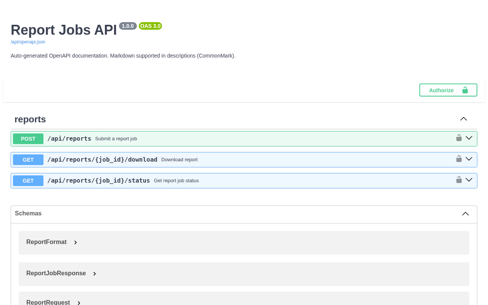
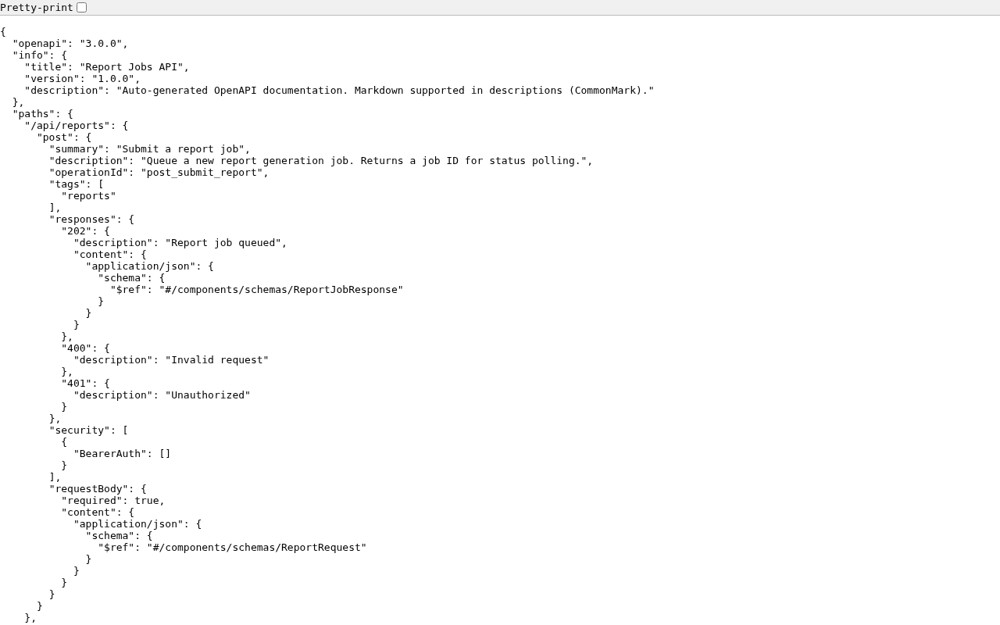

# Deploy to Azure

This guide walks you through deploying `azure-functions-openapi` to Azure, step by step.
No Azure experience required.

## Who this guide is for

You know Python and pip, and you can run the examples locally.
Now you want to deploy to Azure Functions and verify both your API endpoints and OpenAPI docs endpoints.

## What you are deploying

`azure-functions-openapi` adds OpenAPI support to Azure Functions Python apps.
In this guide, you deploy example apps that provide:

- Runtime API endpoints (`report_jobs`, `notification_request`)
- Generated OpenAPI documents at `/api/openapi.json` and `/api/openapi.yaml`
- Swagger UI at `/api/docs`
- Security-focused response headers on the docs page (`Content-Security-Policy`, `X-Frame-Options`, HSTS, and others)

## Azure concepts you need for this guide

> New to Azure? Read [Choose an Azure Functions Hosting Plan](choose-a-plan.md) first.

| Term | What it means |
|---|---|
| **Function App** | Your deployed app in Azure. It can contain multiple HTTP functions. |
| **Hosting plan** | The compute model for your Function App (scaling, timeout, cost). |
| **Resource Group** | A container for related resources. Delete it to clean up everything. |
| **Storage Account** | Required by Azure Functions for runtime state and deployment internals. |
| **Application Insights** | Monitoring resource Azure creates for logs and telemetry. |

## Recommended plan for this repo

| | |
|---|---|
| **Default plan** | Flex Consumption |
| **Why** | Cheapest entry point, scale-to-zero, and enough timeout for these examples. |
| **Switch to Premium if** | You need lower cold-start latency or large dependency footprints. |

## Before you start

| Requirement | How to check | Install if missing |
|---|---|---|
| Azure account | [portal.azure.com](https://portal.azure.com) | [Create free account](https://azure.microsoft.com/free/) |
| Azure CLI | `az --version` | [Install Azure CLI](https://learn.microsoft.com/cli/azure/install-azure-cli) |
| Azure Functions Core Tools v4 | `func --version` | [Install Core Tools](https://learn.microsoft.com/azure/azure-functions/functions-run-local#install-the-azure-functions-core-tools) |
| Python 3.10-3.13 | `python3 --version` | [python.org](https://www.python.org/downloads/) |
| Package examples available | `ls examples` | Clone this repo again if missing |
| Local example works | `func start` + local `curl` | See [README](https://github.com/yeongseon/azure-functions-openapi-python/blob/main/README.md) |

> Verify locally first. If it fails locally, deployment troubleshooting is much harder.

## Read these warnings before provisioning

1. **Storage account names are globally unique.** Only lowercase letters and numbers, 3–24 characters.
2. **Use one region across all resources.** Mixed regions can increase latency and failures.
3. **Deploy from the correct example directory.** Publishing from the wrong folder gives wrong functions and wrong OpenAPI output.
4. **OpenAPI and Swagger routes are regular functions.** If `auth_level` for `openapi.json`, `openapi.yaml`, or `docs` is not anonymous, direct `curl` checks can return `401/403`.
5. **Swagger UI route path is `/api/docs` by default.** If your host config or route prefix changes, docs URL changes too.
6. **First publish is slower.** Azure performs a remote build and installs dependencies.

---

## Example 1: report_jobs

This is the primary guided path. It demonstrates Bearer token authentication, async job submission, status polling, and file download.

### Step 1 — Create a Function App project from the example

The `examples/` directories contain source modules, not standalone Azure Functions projects.
Copy the example into a new project directory that has the required scaffolding:

```bash
mkdir -p my-report-app
cp examples/report_jobs/function_app.py my-report-app/

# Create the required host.json (Azure Functions project root marker)
cat > my-report-app/host.json << 'EOF'
{
  "version": "2.0",
  "extensionBundle": {
    "id": "Microsoft.Azure.Functions.ExtensionBundle",
    "version": "[4.*, 5.0.0)"
  }
}
EOF

cd my-report-app
```

### Step 2 — Create and activate a virtual environment

```bash
python3 -m venv .venv
source .venv/bin/activate
python -m pip install --upgrade pip
```

### Step 3 — Install dependencies

```bash
pip install azure-functions azure-functions-openapi pydantic pyyaml
```

### Step 4 — Verify local app starts

```bash
func start
```

In another terminal, verify one endpoint:

```bash
curl -s -i -X POST http://localhost:7071/api/reports \
  -H "Content-Type: application/json" \
  -H "Authorization: Bearer test-token-123" \
  -d '{"report_type":"monthly_sales","date_from":"2026-01-01","date_to":"2026-01-31"}'
```

Stop the local server with `Ctrl+C`.

### Step 5 — Sign in to Azure and select subscription

```bash
az login
az account list -o table
SUBSCRIPTION_ID="$(az account show --query id -o tsv)"
az account set --subscription "$SUBSCRIPTION_ID"
```

### Step 6 — Define deployment variables

```bash
RESOURCE_GROUP="rg-openapi-reports"
LOCATION="koreacentral"
STORAGE_ACCOUNT="stopenapirpt$(date +%s | tail -c 6)"
FUNCTIONAPP_NAME="func-openapi-reports"
BASE_URL="https://$FUNCTIONAPP_NAME.azurewebsites.net"
```

If needed, list Flex Consumption regions:

```bash
az functionapp list-flexconsumption-locations -o table
```

### Step 7 — Create Azure resource group

```bash
az group create --name "$RESOURCE_GROUP" --location "$LOCATION"
```

### Step 8 — Create storage account

```bash
az storage account create \
  --name "$STORAGE_ACCOUNT" \
  --resource-group "$RESOURCE_GROUP" \
  --location "$LOCATION" \
  --sku Standard_LRS
```

### Step 9 — Create Function App on Flex Consumption

```bash
az functionapp create \
  --name "$FUNCTIONAPP_NAME" \
  --resource-group "$RESOURCE_GROUP" \
  --storage-account "$STORAGE_ACCOUNT" \
  --flexconsumption-location "$LOCATION" \
  --runtime python \
  --runtime-version 3.11
```

### Step 10 — Publish the app

```bash
func azure functionapp publish "$FUNCTIONAPP_NAME"
```

Expected function names include:

- `submit_report`, `get_report_status`, `download_report`
- `openapi_spec`, `openapi_yaml_spec`, `swagger_ui`

### Step 11 — Verify report API endpoints

Submit a report job:

```bash
curl -s -i -X POST "$BASE_URL/api/reports" \
  -H "Content-Type: application/json" \
  -H "Authorization: Bearer test-token-123" \
  -d '{"report_type":"monthly_sales","date_from":"2026-01-01","date_to":"2026-01-31"}'
```

Check job status (replace `<job_id>` with the `job_id` from the response above):

```bash
curl -s -i "$BASE_URL/api/reports/<job_id>/status" \
  -H "Authorization: Bearer test-token-123"
```

Download report (available when status is `completed`):

```bash
curl -s -i "$BASE_URL/api/reports/<job_id>/download" \
  -H "Authorization: Bearer test-token-123"
```

Test unauthorized access (no Bearer token):

```bash
curl -s -i -X POST "$BASE_URL/api/reports" \
  -H "Content-Type: application/json" \
  -d '{"report_type":"monthly_sales","date_from":"2026-01-01","date_to":"2026-01-31"}'
```

Expected: `401 Unauthorized` with `{"error": "Missing or invalid Authorization header"}`.

### Step 12 — Verify OpenAPI JSON, YAML, and Swagger UI

OpenAPI JSON:

```bash
curl -s -i "$BASE_URL/api/openapi.json"
```

OpenAPI YAML:

```bash
curl -s -i "$BASE_URL/api/openapi.yaml"
```

Swagger UI HTML:

```bash
curl -s -i "$BASE_URL/api/docs"
```

For Swagger UI, confirm these headers exist:

- `Content-Security-Policy`
- `X-Content-Type-Options: nosniff`
- `X-Frame-Options: DENY`
- `Strict-Transport-Security`

You can also verify visually by opening these URLs in a browser:



*Swagger UI at `/api/docs` — lists all decorated endpoints with request/response schemas.*



*Generated OpenAPI spec at `/api/openapi.json` — always in sync with your `@openapi` decorators.*

### Step 13 — Optional: watch live logs

```bash
func azure functionapp logstream "$FUNCTIONAPP_NAME"
```

Press `Ctrl+C` to stop log streaming.

---

## Example 2: notification_request

Try another example with request validation powered by `azure-functions-validation`.

### Step 1 — Create a Function App project from the example

```bash
mkdir -p my-notification-app
cp examples/notification_request/function_app.py my-notification-app/

cat > my-notification-app/host.json << 'EOF'
{
  "version": "2.0",
  "extensionBundle": {
    "id": "Microsoft.Azure.Functions.ExtensionBundle",
    "version": "[4.*, 5.0.0)"
  }
}
EOF

cd my-notification-app
```

### Step 2 — Install dependencies

```bash
python3 -m venv .venv
source .venv/bin/activate
python -m pip install --upgrade pip
pip install azure-functions azure-functions-openapi azure-functions-validation pydantic
```

### Step 3 — Set variables and create resources

```bash
RESOURCE_GROUP="rg-openapi-notifications"
LOCATION="koreacentral"
STORAGE_ACCOUNT="stopenapintf$(date +%s | tail -c 6)"
FUNCTIONAPP_NAME="func-openapi-notifications"
BASE_URL="https://$FUNCTIONAPP_NAME.azurewebsites.net"

az login
SUBSCRIPTION_ID="$(az account show --query id -o tsv)"
az account set --subscription "$SUBSCRIPTION_ID"

az group create --name "$RESOURCE_GROUP" --location "$LOCATION"

az storage account create \
  --name "$STORAGE_ACCOUNT" \
  --resource-group "$RESOURCE_GROUP" \
  --location "$LOCATION" \
  --sku Standard_LRS

az functionapp create \
  --name "$FUNCTIONAPP_NAME" \
  --resource-group "$RESOURCE_GROUP" \
  --storage-account "$STORAGE_ACCOUNT" \
  --flexconsumption-location "$LOCATION" \
  --runtime python \
  --runtime-version 3.11
```

### Step 4 — Publish and verify endpoints

```bash
func azure functionapp publish "$FUNCTIONAPP_NAME"
```

Send email notification:

```bash
curl -s -i -X POST "$BASE_URL/api/notifications/email" \
  -H "Content-Type: application/json" \
  -d '{"to":["alice@example.com"],"subject":"Test","body_text":"Hello from Azure"}'
```

Check notification status (replace `<notification_id>` with the ID from the response above):

```bash
curl -s -i "$BASE_URL/api/notifications/status?notification_id=<notification_id>"
```

Invalid payload (validation expected):

```bash
curl -s -i -X POST "$BASE_URL/api/notifications/email" \
  -H "Content-Type: application/json" \
  -d '{"to":[],"subject":"","body_text":""}'
```

Check docs endpoints:

```bash
curl -s -i "$BASE_URL/api/openapi.json"
curl -s -i "$BASE_URL/api/openapi.yaml"
curl -s -i "$BASE_URL/api/docs"
```

---

## CLI spec generation

After deployment (or in CI), you can generate a static OpenAPI file directly from `function_app.py`.

From either example directory:

```bash
azure-functions-openapi generate \
  --app-path ./function_app.py \
  --format json \
  --output ./openapi.json
```

Generate YAML instead:

```bash
azure-functions-openapi generate \
  --app-path ./function_app.py \
  --format yaml \
  --output ./openapi.yaml
```

See [`docs/cli.md`](./cli.md) for full CLI options.

## If you need a different plan

This guide uses Flex Consumption. For Premium or Dedicated commands, see [Choose an Azure Functions Hosting Plan](choose-a-plan.md).

### Premium (EP1)

```bash
az functionapp plan create \
  --name "${FUNCTIONAPP_NAME}-plan" \
  --resource-group "$RESOURCE_GROUP" \
  --location "$LOCATION" \
  --sku EP1 \
  --is-linux

az functionapp create \
  --name "$FUNCTIONAPP_NAME" \
  --resource-group "$RESOURCE_GROUP" \
  --storage-account "$STORAGE_ACCOUNT" \
  --plan "${FUNCTIONAPP_NAME}-plan" \
  --runtime python \
  --runtime-version 3.11 \
  --os-type Linux
```

### Dedicated (B1)

```bash
az appservice plan create \
  --name "${FUNCTIONAPP_NAME}-plan" \
  --resource-group "$RESOURCE_GROUP" \
  --location "$LOCATION" \
  --sku B1 \
  --is-linux

az functionapp create \
  --name "$FUNCTIONAPP_NAME" \
  --resource-group "$RESOURCE_GROUP" \
  --storage-account "$STORAGE_ACCOUNT" \
  --plan "${FUNCTIONAPP_NAME}-plan" \
  --runtime python \
  --runtime-version 3.11 \
  --os-type Linux
```

## Troubleshooting

### Provisioning failed

| Symptom | Usually means | How to fix |
|---|---|---|
| `StorageAccountAlreadyTaken` | Storage account name is already used globally | Change the name suffix and retry |
| `LocationNotAvailableForResourceType` | Flex Consumption not available in selected region | Run `az functionapp list-flexconsumption-locations -o table` and choose a supported region |
| `SubscriptionNotFound` | Wrong subscription selected | Run `az account list -o table`, then set `SUBSCRIPTION_ID` again |

### Deployment failed

| Symptom | Usually means | How to fix |
|---|---|---|
| `ModuleNotFoundError` during publish | Missing or incomplete dependencies | Reinstall with `pip install azure-functions-openapi pydantic` and republish |
| `Can't find app with name` | Function App not ready yet | Wait 30-60 seconds and rerun publish |
| Publish is very slow | First remote build is still running | Wait, then rerun once if it times out |

### OpenAPI and Swagger issues

| Symptom | Usually means | How to fix |
|---|---|---|
| `404` on `/api/docs` | Wrong route prefix or docs route changed | Verify `app.route(route="docs")` and host route prefix |
| `/api/openapi.json` is empty or missing endpoints | OpenAPI decorators are missing or not imported | Confirm functions use `@openapi` and app starts without import errors |
| `/api/openapi.yaml` returns `401/403` | Auth level is not anonymous on docs functions | Set `auth_level=func.AuthLevel.ANONYMOUS` for OpenAPI/docs routes and redeploy |
| Swagger UI loads but fails to fetch spec | Spec URL blocked or wrong path | Confirm `/api/openapi.json` is reachable directly with `curl` |
| Missing hardening headers on `/api/docs` | Docs response not coming from `render_swagger_ui()` | Ensure docs function returns `render_swagger_ui()` and redeploy |

### Logs and monitoring

```bash
func azure functionapp logstream "$FUNCTIONAPP_NAME"

az monitor app-insights events show \
  --app "$FUNCTIONAPP_NAME" \
  --resource-group "$RESOURCE_GROUP" \
  --type requests \
  --offset 1h
```

### Before opening an issue

Share these outputs so maintainers can reproduce quickly:

```bash
az --version
func --version
python3 --version
pip show azure-functions-openapi

az functionapp show \
  --name "$FUNCTIONAPP_NAME" \
  --resource-group "$RESOURCE_GROUP" \
  --query "{state:state,runtimeVersion:siteConfig.linuxFxVersion}"

curl -s -i "$BASE_URL/api/openapi.json"
curl -s -i "$BASE_URL/api/docs"
```

## Clean up resources

Azure resources keep billing until deleted.

```bash
az group delete --name "rg-openapi-reports" --yes --no-wait
az group delete --name "rg-openapi-notifications" --yes --no-wait
```

Verify cleanup:

```bash
az group list --query "[?starts_with(name, 'rg-openapi')]" -o table
```

## Sources

- [Azure Functions Python quickstart](https://learn.microsoft.com/azure/azure-functions/create-first-function-cli-python)
- [Azure Functions Core Tools reference](https://learn.microsoft.com/azure/azure-functions/functions-core-tools-reference)
- [Azure Functions hosting options](https://learn.microsoft.com/azure/azure-functions/functions-scale)
- [Flex Consumption plan](https://learn.microsoft.com/azure/azure-functions/flex-consumption-plan)
- [Azure Functions app settings](https://learn.microsoft.com/azure/azure-functions/functions-how-to-use-azure-function-app-settings)

## See Also

- [Choose an Azure Functions Hosting Plan](choose-a-plan.md) — Plan selection guide with decision tree
- [CLI guide](./cli.md)
- [`azure-functions-scaffold`](https://github.com/yeongseon/azure-functions-scaffold)
- [`azure-functions-validation`](https://github.com/yeongseon/azure-functions-validation)
- [`azure-functions-doctor`](https://github.com/yeongseon/azure-functions-doctor)
- [`azure-functions-logging`](https://github.com/yeongseon/azure-functions-logging)
- [`azure-functions-langgraph`](https://github.com/yeongseon/azure-functions-langgraph)
