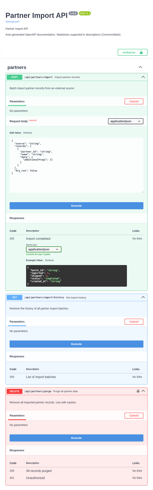

# Partner Import Bridge Example

This is the bridge example showing how to generate OpenAPI docs from
`@validate_http` decorators without using `@openapi` on every handler.
It uses `scan_validation_metadata(app)`, `register_openapi_metadata()`,
and the `OpenAPIOperationMetadata` dataclass.

Source: `examples/partner_import_bridge/function_app.py`

## What this example includes

| Method | Route | Purpose |
| --- | --- | --- |
| `POST` | `/api/partners/import` | Import partner records |
| `GET` | `/api/partners/import/history` | Get import history |
| `DELETE` | `/api/partners/purge` | Purge all partner data |
| `GET` | `/api/openapi.json` | OpenAPI JSON |
| `GET` | `/api/docs` | Swagger UI |

## Features demonstrated

- `scan_validation_metadata(app)` — auto-register OpenAPI metadata from `@validate_http`
- `register_openapi_metadata()` — programmatic registration for endpoints
- `request_model` parameter on `register_openapi_metadata()` — proper Pydantic schema conversion
- `OpenAPIOperationMetadata` dataclass — structured alternative to keyword arguments
- `request_body_required` flag
- `security` and `security_scheme` via programmatic registration

## When to use the bridge pattern

| Approach | Best for |
| --- | --- |
| `@openapi` decorator | Full control over OpenAPI metadata per endpoint |
| `@openapi` + `@validate_http` stacked | Synchronized docs and validation with shared models |
| Bridge (`register_openapi_metadata`) | Auto-generate docs from validation decorators, add metadata programmatically |

The bridge pattern is useful when:

- You already have `@validate_http` on all handlers and want docs without adding `@openapi` to each one
- You register routes dynamically and need programmatic metadata control
- You want to centralize OpenAPI metadata registration in one place

## Data models

```python
class PartnerRecord(BaseModel):
    partner_id: str = Field(..., description="External partner identifier.")
    name: str = Field(..., description="Partner display name.")
    data: dict[str, Any] = Field(default_factory=dict, description="Arbitrary partner data.")


class ImportBatchRequest(BaseModel):
    source: str = Field(..., description="Import source system identifier.")
    records: list[PartnerRecord] = Field(..., min_length=1, description="Records to import.")
    dry_run: bool = Field(default=False, description="If true, validate without persisting.")


class ImportBatchResponse(BaseModel):
    batch_id: str = Field(..., description="Unique batch identifier.")
    imported: int = Field(..., description="Number of records imported.")
    skipped: int = Field(default=0, description="Number of records skipped (duplicates).")
    status: str = Field(default="completed", description="Batch status.")
    created_at: str = Field(..., description="ISO-8601 timestamp.")
```

## How the docs are configured

### Step 1: Scan for validation metadata

```python
from azure_functions_openapi import scan_validation_metadata

scan_validation_metadata(app)
```

### Step 2: Register metadata programmatically

For endpoints using `@validate_http`, use `request_model` to get proper schema conversion:

```python
from azure_functions_openapi import register_openapi_metadata

register_openapi_metadata(
    path="/api/partners/import",
    method="POST",
    summary="Import partner records",
    description="Batch import partner records from an external source.",
    tags=["partners"],
    request_model=ImportBatchRequest,
    response_model=ImportBatchResponse,
    response={200: {"description": "Import completed"}},
)
```

### Step 3: Use OpenAPIOperationMetadata for structured registration

```python
from azure_functions_openapi import OpenAPIOperationMetadata

_bulk_delete_meta = OpenAPIOperationMetadata(
    path="/api/partners/purge",
    method="DELETE",
    summary="Purge all partner data",
    description="Remove all imported partner records. Use with caution.",
    tags=["partners"],
    request_body_required=False,
    response={
        200: {"description": "All records purged"},
        401: {"description": "Unauthorized"},
    },
    security=[{"ApiKeyAuth": []}],
    security_scheme={
        "ApiKeyAuth": {
            "type": "apiKey",
            "in": "header",
            "name": "X-API-Key",
        }
    },
)
register_openapi_metadata(**vars(_bulk_delete_meta))
```

!!! note "request_model vs request_body"
    Use `request_model` when you have a Pydantic model. It converts `$defs`/`$ref`
    patterns into proper `#/components/schemas/...` references. Using raw
    `model_json_schema()` output via `request_body` can produce invalid OpenAPI 3.0.
    The two parameters are mutually exclusive.

## Run locally

The `examples/` directories contain source modules, not standalone Function App projects.
To run locally, copy the example into a project directory with the required `host.json`:

```bash
mkdir -p my-bridge-app
cp examples/partner_import_bridge/function_app.py my-bridge-app/
cat > my-bridge-app/host.json << 'EOF'
{
  "version": "2.0",
  "extensionBundle": {
    "id": "Microsoft.Azure.Functions.ExtensionBundle",
    "version": "[4.*, 5.0.0)"
  }
}
EOF

cd my-bridge-app
python -m venv .venv
source .venv/bin/activate
pip install azure-functions azure-functions-openapi azure-functions-validation pydantic
func start
```

## Test with `curl`

### 1) Import partner records

```bash
curl -X POST "http://localhost:7071/api/partners/import" \
  -H "Content-Type: application/json" \
  -d '{"source":"crm","records":[{"partner_id":"P001","name":"Acme Corp","data":{"tier":"gold"}}]}'
```

Expected output:

```json
{"batch_id":"imp_abc123def456","imported":1,"skipped":0,"status":"completed","created_at":"2026-04-12T00:00:00+00:00"}
```

### 2) Dry run (validate without persisting)

```bash
curl -X POST "http://localhost:7071/api/partners/import" \
  -H "Content-Type: application/json" \
  -d '{"source":"crm","records":[{"partner_id":"P001","name":"Acme Corp"}],"dry_run":true}'
```

Expected output:

```json
{"batch_id":"imp_abc123def456","imported":1,"skipped":0,"status":"dry_run","created_at":"2026-04-12T00:00:00+00:00"}
```

### 3) Get import history

```bash
curl "http://localhost:7071/api/partners/import/history"
```

### 4) Purge all records

```bash
curl -X DELETE "http://localhost:7071/api/partners/purge" \
  -H "X-API-Key: my-admin-key"
```

Expected output:

```json
{"purged":1,"status":"completed"}
```

### 5) Purge without API key

```bash
curl -i -X DELETE "http://localhost:7071/api/partners/purge"
```

Expected status:

```text
HTTP/1.1 401 Unauthorized
```

## Inspect generated spec

```bash
curl "http://localhost:7071/api/openapi.json"
```

You should see:

- three operations under `partners` tag
- `ImportBatchRequest` and `ImportBatchResponse` as component schemas (not inline `$defs`)
- `securitySchemes.ApiKeyAuth` for the purge endpoint
- `PartnerRecord` referenced within `ImportBatchRequest`

## Open Swagger UI

Open `http://localhost:7071/api/docs` in your browser.

Expected behavior:

- all `partners` operations grouped under one tag
- `Authorize` button for API key input
- nested `PartnerRecord` model visible in request body editor



## Production takeaways

- Use `request_model` instead of raw `model_json_schema()` for proper schema references
- `scan_validation_metadata(app)` picks up `@validate_http` metadata automatically when available
- Use `OpenAPIOperationMetadata` for centralized, structured metadata management
- `request_body_required=False` is useful for endpoints that accept optional request bodies

## Related docs

- [Usage](../usage.md)
- [Configuration](../configuration.md)
- [FAQ](../faq.md)
- [Troubleshooting](../troubleshooting.md)
