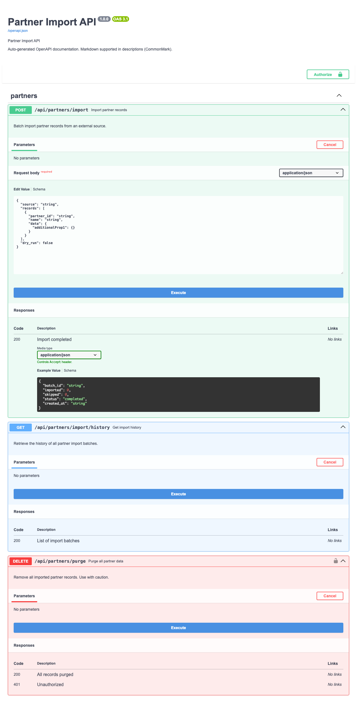

# Usage Guide

This guide shows how to document Azure Functions Python v2 HTTP handlers with `azure-functions-openapi` using production-ready patterns.

## Before you start

- Install package: `pip install azure-functions-openapi`
- Use Azure Functions Python v2 programming model (`func.FunctionApp`)
- Ensure your app has explicit routes for OpenAPI JSON/YAML and Swagger UI

See [Installation](installation.md) and [Getting Started](getting-started.md) first.

For configurable URL prefixes (custom or empty `host.json` `routePrefix`),
see [Route Prefix](route-prefix.md).

## End-to-end baseline

```python
import json

import azure.functions as func
from pydantic import BaseModel

from azure_functions_openapi import get_openapi_json, get_openapi_yaml, openapi, render_swagger_ui

app = func.FunctionApp()


class EchoRequest(BaseModel):
    message: str


class EchoResponse(BaseModel):
    echoed: str


@app.function_name(name="echo")
@openapi(
    summary="Echo message",
    description="Returns the same message received in the request body.",
    tags=["Echo"],
    operation_id="echoMessage",
    route="/api/echo",
    method="post",
    requests=EchoRequest,
    responses={
        200: {
            "description": "Echoed message",
            "content": {"application/json": {"schema": EchoResponse}},
        },
        400: {"description": "Invalid body"},
    },
    )
@app.route(route="echo", methods=["POST"], auth_level=func.AuthLevel.ANONYMOUS)
def echo(req: func.HttpRequest) -> func.HttpResponse:
    try:
        data = EchoRequest.model_validate_json(req.get_body())
    except Exception:
        return func.HttpResponse("Invalid body", status_code=400)

    return func.HttpResponse(
        json.dumps({"echoed": data.message}),
        mimetype="application/json",
        status_code=200,
    )


@app.function_name(name="openapi_json")
@app.route(route="openapi.json", methods=["GET"], auth_level=func.AuthLevel.ANONYMOUS)
def openapi_json(req: func.HttpRequest) -> func.HttpResponse:
    return func.HttpResponse(
        get_openapi_json(title="Echo API", version="1.0.0"),
        mimetype="application/json",
    )


@app.function_name(name="openapi_yaml")
@app.route(route="openapi.yaml", methods=["GET"], auth_level=func.AuthLevel.ANONYMOUS)
def openapi_yaml(req: func.HttpRequest) -> func.HttpResponse:
    return func.HttpResponse(
        get_openapi_yaml(title="Echo API", version="1.0.0"),
        mimetype="application/x-yaml",
    )


@app.function_name(name="swagger_ui")
@app.route(route="docs", methods=["GET"], auth_level=func.AuthLevel.ANONYMOUS)
def swagger_ui(req: func.HttpRequest) -> func.HttpResponse:
    return render_swagger_ui(title="Echo API Docs", openapi_url="/api/openapi.json")
```

## Understanding `@openapi`

`@openapi` captures metadata and stores it in a registry consumed by spec generators.

### Minimal metadata

```python
@openapi(summary="Health check")
```

### Typical metadata

```python
@openapi(
    summary="Get order",
    description="Fetch one order by ID.",
    tags=["Orders"],
    operation_id="getOrder",
    route="/api/orders/{order_id}",
    method="get",
)
```

!!! note
    If `tags` is omitted, the library defaults to `['default']`.

## Request and response schema styles

`@openapi` exposes two **unified** schema parameters — `requests` and
`responses` — each of which accepts *either* a Pydantic model class *or* a raw
schema dict. Prefer these over the older discrete parameters.

!!! warning "Discrete parameters were removed from `@openapi` (issue #285)"
    `request_model` / `request_body` / `response_model` / `response` were
    **removed** from `@openapi`; use `requests` and `responses` instead. The
    discrete parameters remain available on `register_openapi_metadata()`. See
    the [migration guide](migration/unified-params.md) for before/after recipes
    (every discrete case now migrates).

### Style A: Pydantic models

Best when you already validate payloads with Pydantic. Pass the model class
directly to `requests` / `responses`.

```python
class CreateOrderRequest(BaseModel):
    sku: str
    quantity: int


class OrderResponse(BaseModel):
    id: int
    sku: str
    quantity: int


@openapi(
    summary="Create order",
    method="post",
    requests=CreateOrderRequest,
    responses=OrderResponse,
)
```

`responses=OrderResponse` derives the `200` response schema from the model.

### Style B: Raw schema dictionaries

Best when you do not use Pydantic. Pass a raw requestBody schema dict to
`requests` and a manual responses map (keyed by status code) to `responses`.

```python
@openapi(
    summary="Create order",
    method="post",
    requests={
        "type": "object",
        "properties": {
            "sku": {"type": "string"},
            "quantity": {"type": "integer", "minimum": 1},
        },
        "required": ["sku", "quantity"],
    },
    responses={
        201: {
            "description": "Created",
            "content": {
                "application/json": {
                    "schema": {
                        "type": "object",
                        "properties": {"id": {"type": "integer"}},
                    }
                }
            },
        }
    },
)
```

!!! note
    `requests` decides its meaning by type: a `BaseModel` subclass is treated
    like the old `request_model`, and a `dict` is treated like the old
    `request_body`. `responses` behaves the same way.

### Optional request bodies

Set `request_body_required=False` when the request body is optional (it
defaults to `True`):

```python
@openapi(
    summary="Partial update",
    method="patch",
    requests=PatchOrderRequest,
    request_body_required=False,
)
```

### Migrating to `requests` / `responses`

| Old (removed from `@openapi`) | New |
| --- | --- |
| `request_model=Model` | `requests=Model` |
| `request_body={...}` | `requests={...}` |
| `response_model=Model` | `responses=Model` |
| `response={201: {...}}` | `responses={201: {...}}` |

!!! tip "A typed success body plus extra status codes now migrates too"
    `responses=` accepts **either** a model (typed `200` schema) **or** a
    per-status map — and a value **inside** that map may itself be a model. So a
    typed success body combined with additional status codes (formerly the
    `response_model=Model` + `response={...}` pair) is now expressible as a
    single map, e.g. `responses={202: AcceptedModel, 422: {"description": ...}}`
    (unblocked by issue #410 / #418). See the [migration
    guide](migration/unified-params.md) for full before/after recipes and the
    removal policy.

## Inferred metadata (return type & docstring)

`@openapi` can infer parts of the operation from what the handler already
declares, so you can shrink the decorator toward minimal. Inference is always
**gap-fill-only, lowest-precedence, and failure-silent**: it never overrides an
explicit value, never raises on unresolved annotations, and applies at both
decorator-time (`@openapi`) and scan-time (a bare `@app.route` with no
`@openapi`).

**Precedence (highest to lowest):**

1. Explicit `@openapi` arguments (e.g. `responses=`, `summary=`).
2. Validation / enrichment metadata (e.g. from `@validate_http`).
3. Inference (return type, docstring).

### Return-type inference

When you supply no explicit `responses=`, the handler's return annotation infers
the `200` response:

```python
@openapi(summary="Get order")
@app.route(route="orders/{id}", methods=["GET"])
def get_order(req: func.HttpRequest) -> OrderResponse:  # -> 200 OrderResponse schema
    ...
```

- `-> User` (a Pydantic `BaseModel`) → `200` response with the model schema.
- `-> list[User]` / `Optional[User]` → the same array / union shorthand as an
  explicit `responses=` shorthand.
- Non-documentable returns infer **nothing** (no `200` is fabricated):
  `-> None`, `-> Any`, `-> func.HttpResponse`, bare scalars (`-> str`,
  `-> int`), and unsupported generics.
- An unresolved forward reference (e.g. under
  `from __future__ import annotations`) simply infers nothing rather than
  failing.

### Docstring inference

When you omit `summary`/`description`, the handler docstring fills them: the
first non-empty line becomes the `summary`, and the remainder becomes the
`description`.

```python
@openapi()
@app.route(route="ping", methods=["GET"])
def ping(req: func.HttpRequest) -> str:
    """Health check.

    Returns 200 while the app is serving traffic.
    """
    ...
# summary="Health check."
# description="Returns 200 while the app is serving traffic."
```

Each field is inferred **independently**, and explicit always wins:

- Omit `summary`/`description` (leave them unset) → inferred from the docstring.
- Pass an explicit non-empty value → that value is used, docstring ignored for
  that field.
- Pass an explicit empty string (`summary=""` / `description=""`) → inference is
  **suppressed** for that field (the empty string is treated as a deliberate
  "leave it blank"). A missing or blank docstring also infers nothing.

## Streaming responses (OpenAPI 3.2)

OpenAPI 3.2 adds first-class support for **sequential / streaming media types**
such as Server-Sent Events (`text/event-stream`), `application/jsonl`, and
`application/json-seq`. Each streamed item is described with the Media Type
Object's **`itemSchema`** field (the `schema` field, when present, describes the
complete body as a whole).

Pass a raw Response Object with an `itemSchema` entry — a Pydantic model, a
generic alias like `list[Model]`, or an inline JSON Schema dict are all resolved
the same way the `schema` position is:

```python
from pydantic import BaseModel


class ChatDelta(BaseModel):
    token: str
    index: int


@openapi(
    summary="Stream chat completions",
    method="get",
    route="/api/chat/stream",
    responses={
        200: {
            "description": "Server-sent event stream of chat deltas",
            "content": {
                # itemSchema describes each streamed event
                "text/event-stream": {"itemSchema": ChatDelta},
            },
        }
    },
)
@app.route(route="chat/stream", methods=["GET"])
def chat_stream(req):
    ...
```

Generate the document with `openapi_version="3.2.0"` so the streaming media type
is emitted under a spec version that understands `itemSchema`:

```python
spec = generate_openapi_spec(openapi_version="3.2.0")
```

> `itemSchema` is an OpenAPI 3.2 construct. If you emit it while targeting
> `3.0.0` or `3.1.0`, the field is still written out but a `RuntimeWarning` is
> raised, since 3.0/3.1 tooling may not understand it. Prefer `3.2.0` for
> streaming responses.

## Parameters (query/path/header/cookie)

Use OpenAPI Parameter Objects in `parameters`.

```python
@openapi(
    summary="Get order",
    method="get",
    route="/api/orders/{order_id}",
    parameters=[
        {
            "name": "order_id",
            "in": "path",
            "required": True,
            "schema": {"type": "integer"},
            "description": "Order identifier",
        },
        {
            "name": "include_items",
            "in": "query",
            "required": False,
            "schema": {"type": "boolean", "default": False},
        },
        {
            "name": "X-Correlation-ID",
            "in": "header",
            "required": False,
            "schema": {"type": "string"},
        },
    ],
)
```

### Typed parameters with Pydantic (`path=` / `headers=`)

Writing raw parameter dicts is verbose. For **path** and **header** parameters
you can pass a Pydantic model instead and let each field expand into a
parameter entry — mirroring the Pydantic-first ergonomics of `requests=` /
`responses=`.

```python
from pydantic import BaseModel, Field


class OrderPath(BaseModel):
    order_id: int


class OrderHeaders(BaseModel):
    correlation_id: str = Field(alias="X-Correlation-ID", description="Trace id")


@openapi(
    summary="Get order",
    method="get",
    route="/api/orders/{order_id}",
    path=OrderPath,
    headers=OrderHeaders,
)
def get_order(req): ...
```

Rules:

- **`path=`** — every field becomes `in: path` and is always `required: true`
  (per the OpenAPI spec).
- **`headers=`** — every field becomes `in: header`; `required` follows the
  model (a field with no default is required, an `Optional`/defaulted field is
  not).
- Field **aliases** are used as the wire parameter name; field `description`
  flows onto the parameter.
- Only scalar, enum, and array-of-scalar fields are allowed. **Nested-object
  fields are rejected** because path/header parameters cannot carry objects.
- Typed params **merge** with any raw `parameters=` you also pass. A duplicate
  `(name, in)` pair raises an error instead of silently overriding.
- `query=` is intentionally not offered here — use the OpenAPI 3.2
  [`querystring=`](#the-query-http-method-openapi-32) surface for typed query
  input.

> Like the rest of `@openapi`, this is **documentation only** — it does not
> parse or validate requests at runtime. For runtime validation, layer
> [`azure-functions-validation`](https://github.com/yeongseon/azure-functions-validation-python).

## Security documentation

You can define security at operation-level and component-level.

### API key example

```python
@openapi(
    summary="List invoices",
    method="get",
    security=[{"ApiKeyAuth": []}],
    security_scheme={
        "ApiKeyAuth": {
            "type": "apiKey",
            "in": "header",
            "name": "X-API-Key",
        }
    },
)
```

### Bearer token example

```python
@openapi(
    summary="List invoices",
    method="get",
    security=[{"BearerAuth": []}],
    security_scheme={
        "BearerAuth": {
            "type": "http",
            "scheme": "bearer",
            "bearerFormat": "JWT",
        }
    },
)
```

### Infer security from `auth_level` (opt-in)

Azure Functions routes already declare their auth policy via `auth_level`:

```python
@app.route(route="users", auth_level=func.AuthLevel.FUNCTION, methods=["GET"])
```

Rather than repeating that intent in `@openapi(security=..., security_scheme=...)`,
you can have the spec derive the security requirement and scheme directly from the
route's `auth_level` by passing `infer_auth_level=True`:

```python
spec = generate_openapi_spec(title="My API", infer_auth_level=True)
# get_openapi_json(..., infer_auth_level=True) and
# get_openapi_yaml(..., infer_auth_level=True) accept the same flag.
```

Mapping:

| `auth_level`         | Injected security                                      |
| -------------------- | ------------------------------------------------------ |
| `ANONYMOUS`          | nothing                                                |
| `FUNCTION`           | `apiKey` `x-functions-key` (header), scheme `AzureFunctionKey` |
| `ADMIN`              | `apiKey` `x-functions-key` (header, master key), scheme `AzureFunctionKey` |

Generated output for a `FUNCTION` route:

```yaml
security:
  - AzureFunctionKey: []
components:
  securitySchemes:
    AzureFunctionKey:
      type: apiKey
      in: header
      name: x-functions-key
```

**Notes:**

- The flag defaults to `False`, so existing specs are unchanged unless you opt in.
- Inference only works on the **binding-scan path** — i.e. when the spec is built by
  scanning a `FunctionApp` instance (the CLI `module:variable` form, or
  `scan_endpoint_metadata`). The plain `@openapi`-only path cannot see the HTTP
  trigger binding, so no `auth_level` is available there.
- User-supplied values always win: inference injects `security` / `security_scheme`
  only for operations that have none.
- **`ADMIN` = host master key.** `FUNCTION` accepts a per-function or host key,
  while `ADMIN` requires the host-wide **master key** — both are sent in the
  `x-functions-key` header, so they share the single `AzureFunctionKey` apiKey
  scheme. The distinction is the key's scope/privilege, not the header.
- **APIM subscription keys are a separate concern.** If the app sits behind Azure
  API Management, callers present an APIM **subscription key** (typically the
  `Ocp-Apim-Subscription-Key` header), which is unrelated to Functions
  function/host keys. This inference does not model APIM keys; declare them
  explicitly via `@openapi(security=...)` / `security_schemes` if needed.


## Multiple endpoints and tags

You can annotate each endpoint independently and group by tags.

```python
@openapi(summary="Create customer", tags=["Customers"], method="post")
def create_customer(req: func.HttpRequest) -> func.HttpResponse:
    ...


@openapi(summary="List customers", tags=["Customers"], method="get")
def list_customers(req: func.HttpRequest) -> func.HttpResponse:
    ...


@openapi(summary="Health", tags=["Operations"], method="get")
def health(req: func.HttpRequest) -> func.HttpResponse:
    ...
```

## Spec generation options

Use these APIs when you need programmatic control.

### Generate dictionary spec

```python
from azure_functions_openapi import OPENAPI_VERSION_3_1, generate_openapi_spec

spec = generate_openapi_spec(
    title="Orders API",
    version="2026.03",
    description="Order management service",
    openapi_version=OPENAPI_VERSION_3_1,
    security_schemes={
        "BearerAuth": {
            "type": "http",
            "scheme": "bearer",
            "bearerFormat": "JWT",
        }
    },
)
```

### Top-level and info metadata

`generate_openapi_spec` accepts optional passthrough parameters for document
metadata that would otherwise require post-processing the returned dict (#494).
`contact` and `license` are merged into `info`; `servers`, `external_docs`, and
the top-level `tags` list are emitted at the document root. Each field is added
only when supplied.

```python
spec = generate_openapi_spec(
    title="Orders API",
    servers=[{"url": "https://api.example.com", "description": "prod"}],
    contact={"name": "DX Toolkit", "email": "dx@example.com"},
    license={"name": "MIT", "url": "https://opensource.org/licenses/MIT"},
    external_docs={"url": "https://docs.example.com", "description": "Guide"},
    tags=[{"name": "orders", "description": "Order operations"}],
)
```

### Generate JSON/YAML strings

```python
json_spec = get_openapi_json(title="Orders API", version="2026.03")
yaml_spec = get_openapi_yaml(title="Orders API", version="2026.03")
```

### The `query` HTTP method (OpenAPI 3.2)

OpenAPI 3.2 adds `query`, a safe, idempotent HTTP method that carries a
request payload. Document a handler with `method="query"` and generate a
**3.2** spec to emit it as a first-class path-item operation (with an optional
`requestBody`):

```python
from azure_functions_openapi import OPENAPI_VERSION_3_2, generate_openapi_spec
from azure_functions_openapi.decorator import register_openapi_metadata

register_openapi_metadata(
    "/api/search",
    "query",
    summary="Query search",
    request_body={"type": "object", "properties": {"q": {"type": "string"}}},
)

spec = generate_openapi_spec(openapi_version=OPENAPI_VERSION_3_2)
# spec["paths"]["/api/search"]["query"] -> Operation (with requestBody)
```

Under 3.0/3.1 there is no `query` path-item field, so the operation is dropped
with a warning (and raises under `strict=True`).

    ### Non-standard HTTP methods (OpenAPI 3.2)

    OpenAPI 3.0/3.1 path items only accept the fixed verb set (`get`, `put`,
`post`, `delete`, `options`, `head`, `patch`, `trace`). OpenAPI 3.2 adds an
`additionalOperations` map for methods outside that set (for example `PURGE`
or `LINK`). When you document a handler bound to a non-standard method and
generate a **3.2** spec, the operation is emitted under `additionalOperations`
keyed by the uppercased method name:

```python
from azure_functions_openapi import OPENAPI_VERSION_3_2, generate_openapi_spec
from azure_functions_openapi.decorator import register_openapi_metadata

register_openapi_metadata("/api/cache", "purge", summary="Purge cache")

spec = generate_openapi_spec(openapi_version=OPENAPI_VERSION_3_2)
# spec["paths"]["/api/cache"]["additionalOperations"]["PURGE"] -> Operation
```

Standard methods are unaffected — they stay first-class path-item fields. When
you target 3.0/3.1, a non-standard method cannot be represented, so it is
dropped from the spec with a warning (and raises under `strict=True`).

## Swagger UI route

```python
@app.route(route="docs", methods=["GET"])
def docs(req: func.HttpRequest) -> func.HttpResponse:
    return render_swagger_ui(
        title="Orders API Docs",
        openapi_url="/api/openapi.json",
        enable_client_logging=False,
    )
```



If your deployment needs stricter or custom CSP:

```python
custom_csp = "default-src 'self'; script-src 'self' https://cdn.jsdelivr.net; style-src 'self' 'unsafe-inline' https://cdn.jsdelivr.net"
return render_swagger_ui(custom_csp=custom_csp)
```

## Common pitfalls

- Missing docs endpoints (`openapi.json`, `openapi.yaml`, `docs`)
- Passing non-list to `parameters` or `security`
- Invalid route path with whitespace or dangerous patterns
- Using unsupported OpenAPI version string

See [Troubleshooting](troubleshooting.md) for fixes.

## Validation package integration

`azure-functions-openapi` works well with `azure-functions-validation` when you want runtime payload validation plus generated API docs from the same models.

See [Notification Request Example](examples/notification_request.md) for a complete setup.

### Automatic bridge (zero-duplication)

If you want OpenAPI specs generated automatically from `@validate_http` decorators
without repeating models in `@openapi`, use `scan_endpoint_metadata()`:

```python
from azure_functions_openapi import scan_endpoint_metadata

# After all routes are registered:
scan_endpoint_metadata(app)
```

This scans the app's registered HTTP functions for `@validate_http` metadata
and auto-registers them in the OpenAPI registry. Explicit `@openapi` decorators
always take precedence.

!!! info "No extra dependencies required"
    `scan_endpoint_metadata()` reads the convention-based metadata attribute
    written by `@validate_http` — no extra install step needed beyond having both
    packages in your project.

See [Partner Import Bridge Example](examples/partner_import_bridge.md) for a complete walkthrough.


## Import path migration

The internal module previously named `azure_functions_openapi.openapi` was
renamed to `azure_functions_openapi.spec` to remove a naming conflict with the
public `@openapi` decorator. The old module path remains as a deprecation shim
that emits `DeprecationWarning` and will be removed in a future release.

Update any imports as follows:

**Deprecated** (still works, emits `DeprecationWarning`):

```python
from azure_functions_openapi.openapi import get_openapi_json, get_openapi_yaml
```

**Canonical internal path**:

```python
from azure_functions_openapi.spec import get_openapi_json, get_openapi_yaml
```

**Recommended public API** (preferred for application code):

```python
from azure_functions_openapi import get_openapi_json, get_openapi_yaml
```

The root package re-exports `get_openapi_json`, `get_openapi_yaml`,
`generate_openapi_spec`, `OPENAPI_VERSION_3_0`, `OPENAPI_VERSION_3_1`,
`openapi`, and `render_swagger_ui`, so most user code can import everything
directly from `azure_functions_openapi` without referencing internal
submodules.

## Next steps

- Deep-dive decorator options: [Configuration](configuration.md)
- Auto-generated signatures and docstrings: [API Reference](api.md)
- Generate specs in CI/CD: [CLI](cli.md)
